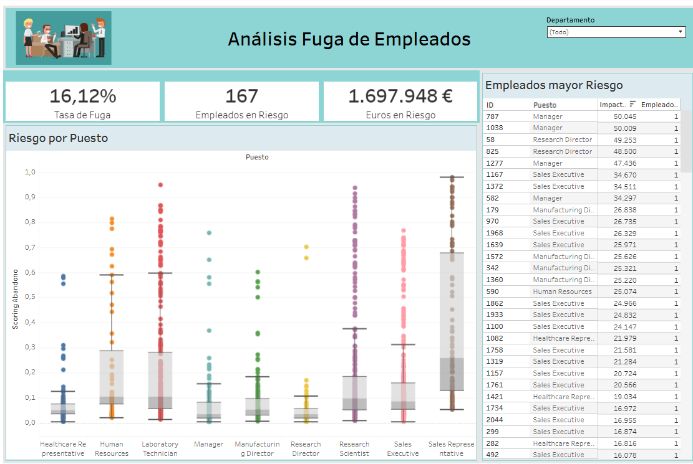

# Análisis Fuga de Empleados

## Objetivo

Proyecto de análisis de datos y machine learning orientado a predecir el abandono de empleados, medir su impacto económico y proponer estrategias de retención.
Incluye carga de datos, preprocesamiento, visualización y, potencialmente, modelos predictivos para comprender y abordar los factores que contribuyen a la rotación de personal.

## Datos

Se utilizan archivos CSV ubicados en el directorio data/. En particular, se emplean data/AbandonoEmpleados.csv y data/abandono_con_scoring.csv.

## Script

El script principal es el cuaderno Jupyter main.ipynb, que contiene el flujo de trabajo del análisis.

## Dependencias

El proyecto emplea las siguientes librerías de Python, especificadas en requirements.txt:

```text
ipykernel
numpy
pandas 
matplotlib
scikit-learn
```

Para instalar estas librerías crea un entorno nuevo y utiliza pip::

```bash
pip install -r requirements.txt
```

## Visualización de Datos y Dashboard

El directorio fuga_empleados_files/ contiene imágenes generadas durante el análisis, principalmente visualizaciones gráficas de los datos.


El dashboard del proyecto está disponible aquí:

  

👉 [Ver Dashboard interactivo en Tableau](https://public.tableau.com/views/DashboardAbandonoEmpleados_17549150031180/Dashboard1)


## Licencia

Este proyecto está licenciado bajo la Licencia MIT - consulte el archivo LICENSE para obtener más detalles.

---

🌍 Este README está disponible en varios idiomas::  
🔗 [readme.maxpfeffer.de](https://readme.maxpfeffer.de/readme/b864d3a6bb18d61b5faef1d717255887a7f795d35b868b3afc5af8126ad8f9e46928e934fd605bfdf34a2bb25fa0f8210ade20b24d632a7542036ec53e208d14/Spanish)